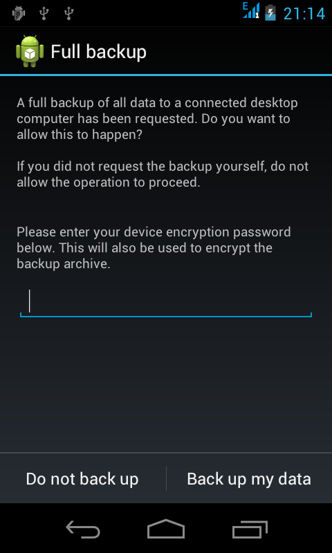
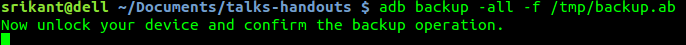
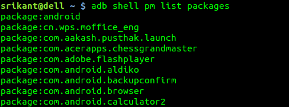
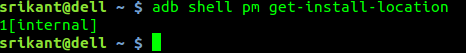
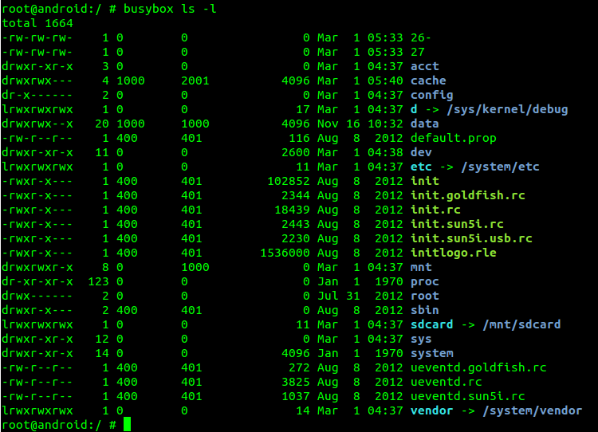
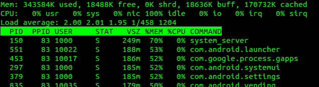

==========================
Advanced Android Debugging
==========================

.. contents::

.. section-numbering::

.. raw:: pdf

   PageBreak oneColumn

.. footer::
   
   Page: ###Page###/###Total###,
   Android workshop, Saturday 2nd March 2013, IIT Bombay 

Debugging   
---------

Any piece of software or hardware ever designed must have gone through debug a
process. Debug provides us a window to sneak into a running application.

Android provides an excellent platform for debugging apk through eclipse IDE. 

However there is more of debugging for advanced users, which is quite useful and fast. 

|
|

Installing adb, and setting debugging environment
-------------------------------------------------

If you have installed and setup android development enviroment for eclipse, then
you have all the debugging tools with you. 

If not, you can install *adb* on Ubuntu-12.10 onwards by ::

	sudo apt-get install android-tools-adb

or you can download the entire Android-sdk(400 MB uncompressed) `here \
<http://developer.android.com/sdk/index.html#download>`_ and setup manually.

or for a 32bit Linux machine, you may download it from this `link \
<https://github.com/androportal/installer/raw/ics/adb>`_ and make the
binary as executable ::

	chmod +x adb

|

Setting udev rules for adb to run as a normal user
~~~~~~~~~~~~~~~~~~~~~~~~~~~~~~~~~~~~~~~~~~~~~~~~~~

Set udev rules for android usb in `/etc/udev/rules.d/51-android.rules`, open
terminal and do ::

	sudo gedit /etc/udev/rules.d/51-android.rules

and enter these two rules ::

	SUBSYSTEM=="usb", ATTR{idVendor}=="19d2", MODE="0666", GROUP="plugdev"
	SUBSYSTEM=="usb", ATTR{idVendor}=="18d1", MODE="0666", GROUP="plugdev"

save and exit. Now restart udev services by ::

	sudo service udev restart

That's all, now enjoy debugging in eclipse or through adb without the need of 
root access. 

|

Getting connected using WiFi, and USB cable
-------------------------------------------

If your project demands a WiFi based debugging then follow this approach. First
ensure that both your host machine and android device are in same WiFi network.

Connect android(Aakash), and host-machine through USB cable. Wait for 
debugging icon on android side, when ready issue ::

		adb tcpip 5555

You will get confirmation message as `restarting in TCP mode port: 5555` on the
terminal emulator. Now remove your USB cable, and issue ::

		adb connect <your-android-device-ip>

If success, it will print `connected` on your terminal.

Now you can debug your android through adb or test apk's through eclipse
debugging wirelessly. 

When done, it's better to disconnect gracefully ::

		adb disconnect <your-android-device-ip>

adb options
-----------

**adb** stands for **android debug bridge**. It's a client command line tool 
which lets you communicate with an emulator instance or connected Android 
device. 

adb push/pull
~~~~~~~~~~~~~

These are most frequently used adb commands. Let's try them.

Assuming the device is connected to host-machine ::

		adb push README.rst /mnt/sdcard

This will copy README.rst to /mnt/sdcard, internal sdcard of Aakash tablet.

 Let's try copying from device to our host-machine ::

	adb pull /mnt/sdcard/README.rst /tmp

This will copy README.rst to `/tmp` directory. 

Let's try pushing a directory to android ::

	adb push data /mnt/sdcard/data

This will copy the content of `data` directory to `data` directory in sdcard.

Similarly you can try pulling this directory to `/tmp` ::

	adb pull /mnt/sdcard/data /tmp/data

adb backup/restore
~~~~~~~~~~~~~~~~~~

These are useful tools. Option `-all` will backup all apps ::

	adb backup -all -f /tmp/backup.ab

Now unlock your android device, and select "Backup up my data". You can optionally
set a password too. 

	
After confirming operation on android device, your terminal emulator will change to 

The backup operation sadly doesn't have any progress bar, it take time depending 
on number of apps installed. 

Similarly, to restore one can do ::

	adb restore /tmp/backup.ab

This will again ask for confirmation on android side, 
select "Restore my data" to start restore process. Again no progress bar. 

.. note:: 
   backup and restore doesn't work with Aakash device. There are many other tools
   freely available for same purpose. 

adb shell
~~~~~~~~~

This is again a most frequently used command. One can use "adb shell" to execute
any shell command inside android environment ::

	adb shell <command>

We will see more of "adb shell" later. 

adb logcat
~~~~~~~~~~

This will simply show live log of all processes running on device. The `-d` 
flag will dump the output to stdout and exit. Let's try this out ::

	adb logcat -d | grep README.rst 

`grep` will search for 'README.rst' in logcat output.

.. image:: data/adb-logcat.png
   :width: 100%

Try searching other terms in logcat for effective debugging or you can run 
logcat to view live status of your android device. 

package manager(pm)
-------------------

(pm) tool perform actions and queries on application packages installed on 
the device. Syntax to use ::

	adb shell pm <command>

Let's try few command to retrieve package information ::

	adb shell pm list packages

If you want to uninstall any package, simply issue ::

	adb shell pm uninstall com.aakash.lab

To set install location for apk's, internal or external sdcard ::

	adb shell pm set-install-location 1

0: Auto—Let system decide the best location

1: internal device storage

2: external media

|

To get current install location ::

	adb shell pm get-install-location

activity manager(am)
--------------------

Within an adb shell, one can issue commands with the activity manager (am)
tool to perform various system actions, such as start an activity, 
force-stop a process etc. 

Let's checkout few examples ::

	adb shell am start -a android.intent.action.VIEW

This will open "Complete action using" menu.

Similarly, if one want to **kill all background apps**, then issue ::

	adb shell am kill-all

To test various screen resolutions for your application ::

	adb shell am display-size 320x240

Remember, you can not test your app in resolution higher than actual screen
resolution.

For eg: on Aakash the native screen resolution is 800x480 so one can't test
apps for 1280x800. 

.. warning:: This option(display-size) may crash your display, you then may
             have to factory reset your device. Works with phone, crashes 
             sometimes with Aakash. So use it wisely. You have been warned. 

By the way, to do factory reset, goto settings -> Backup and reset -> Factory data reset
and confirm. This will remove all the apps. 	

Automating tasks
----------------

Automating tasks on android side
~~~~~~~~~~~~~~~~~~~~~~~~~~~~~~~~

For various reasons you may want your certain script to start automatically when device boots. This 
can be achieved by carefully observing `init.rc` file. 

In case of aakash, to run a bash script at boot time we need to put the entry
of the bash script in **/system/bin/preinstall.sh**, this file get called at
boot time and anything inside it will be executed. 

Explore init.rc and preinstall.sh only if you know what you are doing. Any wrong
entry in **/system/bin/preinstall.sh** may kill your device. 

.. warning:: Again, you have been warned.

Automating tasks on host side
~~~~~~~~~~~~~~~~~~~~~~~~~~~~~

With **adb** , one can easily script, for eg: 

To monitor RAM usage of Android device every 1 sec,
one can write a simple shell script and execute 

.. code-block:: bash
   :linenos:

   #!/bin/sh
    
   while true
   do
      adb shell busybox free -m
      sleep 1
   done
		
The above script can be done in one line too, in terminal emulator ::

	 while true; do adb shell busybox free -m ; sleep 1; done

To cancel the loop, just use ^C .

Let's try another script. This time let's try installing all the apks present
in present working directory ::

	for each in $(ls *.apk); do adb install -r $each; done

These are very trivial examples, there are lot of exciting things possible with
scripts. 

Using busybox
-------------

BusyBox provides several stripped-down Unix tools in a single executable file
(less than 1 MB). It is used in almost every embedded Linux device. 

Inside `adb shell` (i.e in android device) it can be accessed as ::

	busybox

This will print list of commands possible with busybox. Busybox can also be 
accessed from terminal as ::

	adb shell busybox 

To access any command use ::

	adb shell busybox <command-name> <command's-flag>

We will see few important examples with busybox 

Listing all files ::

    busybox ls -l 

Changing file permissions ::

	adb shell busybox chmod 755 /mnt/sdcard

For opening a file for editing, it's better to do **adb shell** first and then::

	busybox vi /mnt/sdcard/README.rst

Use **i** or press <INSERT> key to go to editing mode.

To save, press <ESC> key to exit from editing mode. Then use **:wq** to write and quit. 

If you have edited a file but want to discard changes, press <ESC> to
exit from editing mode, and then use **:q!** to quit without saving. 

To know system load ::

	adb shell busybox top 

To find out partition table ::

	adb shell busybox df -h 

To find out disk usage of any file ::

	adb shell busybox du -sh 

To know list of mounted devices ::

	adb shell mount 

In most of the android devices **/system** is marked 
as `ro`, only when you get **root** access to your device you can make changes
there. But it make sense to mark system partition as `ro` unless required. To 
change our mount options to `ro` ::

	adb shell busybox mount -o rw,remount  /system

Practical example
-----------------

This we use at our Aakash logistics facility, to obtain MAC address from a new
device automatically we use this approach in a Python script::
	
	adb shell svc wifi enable

then ::
	
	adb shell ip link show wlan0 | busybox awk '/ether/ {print $2}'

finally disable wifi, if not required ::
	
	adb shell svc wifi disable

Monitor android
---------------

**Monitor** is a gui tool to monitor packages, apps, threads, processes etc. 
One can use it to capture screenshot too. 

Suggested readings
------------------

#. http://developer.android.com/index.html

#. http://developer.android.com/tools/help/adb.html

