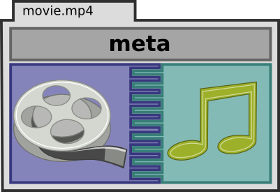
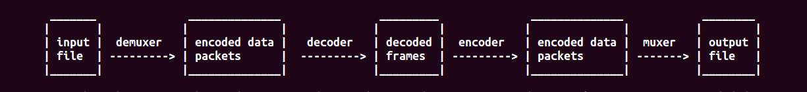

========================================================
AV editing using FFmpeg, sox, Blender, Audacity
========================================================

.. .. contents::

.. .. section-numbering::

.. .. raw:: pdf

..   PageBreak oneColumn

.. .. footer::

..	Page: ###Page###/###Total###

Brief introduction to digital media
-----------------------------------

Digital Audio/Video
~~~~~~~~~~~~~~~~~~~

Compared to the conventional tapes, they are convenient to store, share and
highly cost effective. The A/V data is stored in files with certain extensions. 
Example, mov, mp3, mpg, mp4, mkv etc.

Media compressions
~~~~~~~~~~~~~~~~~~

The raw media files are often considered good for video editing as they retain 
unaltered data from camera/microphone. However, the raw size could be in order 
of hundreds of GB for just an hour of 1080i video. This isn’t suitable for 
transmission and storage. Hence, a compression on original data is applied 
according to the production house requirements. Most studio however prefer 
lossless compression. 

  	
Containers or Formats or Extensions
~~~~~~~~~~~~~~~~~~~~~~~~~~~~~~~~~~~

The formats are often the extensions of the file, technically may be called 
as containers. We will use the term container henceforth. 
A container is a software wrapper which carries encoded A/V and its metadata. 

Codecs
~~~~~~

(Coder-Decoder) The compression of the data is crucial. There are several 
algorithms implemented to optimize the encoding and decoding process. However,
there are known tradeoffs, such as, a highly compressed file may require 
higher CPU while decoding, and so on. The selection of codecs is a thoughtful
process based on factors such as end user, bandwidth, quality, cost etc. 

Few popular codecs are h264, vp8, lame, DivX etc. 
Find more at this `wiki page. <https://en.wikipedia.org/wiki/List_of_open-source_codecs>`_

   MP4 container holding audio, video, and metadata `image source <http://blog.gramant.com/wp-content/uploads/2013/10/container.png>`_

FFmpeg
------

A simple yet powerful cross platform, cross architecture, command line tool to record, convert and 
stream audio and video data. 
There are several projects which use **FFmpeg** in backend, an extensive list 
can be found `here.  <https://trac.ffmpeg.org/wiki/Projects>`_

   FFmpeg block diagram 

FFmpeg quick help
~~~~~~~~~~~~~~~~~

Frequently used command line arguments 

``-i`` ``input file``

Suggested readings and credits
------------------------------

#. http://docutils.sourceforge.net/docs/user/rst/quickref.html

#. http://docutils.sourceforge.net/docs/ref/rst/restructuredtext.html

#. http://sphinx-doc.org/sphinx-rst2pdf.pdf

#. http://sphinx-doc.org/
