========================================================
AV editing using FFmpeg, sox, Blender, Audacity
========================================================

.. .. contents::

.. .. section-numbering::

.. .. raw:: pdf

..   PageBreak oneColumn

.. .. footer::

..	Page: ###Page###/###Total###

Brief introduction to digital media
-----------------------------------

Digital Audio/Video
~~~~~~~~~~~~~~~~~~~

Compared to the conventional tapes, they are convenient to store, share and
highly cost effective. The A/V data is stored in files with certain extensions. 
Example, mov, mp3, mpg, mp4, mkv etc.

Media compressions
~~~~~~~~~~~~~~~~~~

The raw media files are often considered good for video editing as they retain 
unaltered data from camera/microphone. However, the raw size could be in order 
of hundreds of GB for just an hour of 1080i video. This isn’t suitable for 
transmission and storage. Hence, a compression on original data is applied 
according to the production house requirements. Most studio however prefer 
lossless compression. 

  	
Containers or Formats or Extensions
~~~~~~~~~~~~~~~~~~~~~~~~~~~~~~~~~~~

The formats are often the extensions of the file, technically may be called 
as containers. We will use the term container henceforth. 
A container is a software wrapper which carries encoded A/V and its metadata. 

Codecs
~~~~~~

(Coder-Decoder) The compression of the data is crucial. There are several 
algorithms implemented to optimize the encoding and decoding process. However,
there are known tradeoffs, such as, a highly compressed file may require 
higher CPU while decoding, and so on. The selection of codecs is a thoughtful
process based on factors such as end user, bandwidth, quality, cost etc. 

Few popular codecs are h264, vp8, lame, DivX etc. 
Find more at this `wiki page. <https://en.wikipedia.org/wiki/List_of_open-source_codecs>`_

.. figure:: ../data/containers.png
   :scale: 80%	
   :align: center

   MP4 container holding audio, video, and metadata `image source <http://blog.gramant.com/wp-content/uploads/2013/10/container.png>`_

FFmpeg
------

A simple yet powerful cross platform, cross architecture, command line tool to record, convert and 
stream audio and video data. 
There are several projects which use **FFmpeg** in backend, an extensive list 
can be found `here.  <https://trac.ffmpeg.org/wiki/Projects>`_

.. figure:: ../data/ffmpeg-bd.png
   :scale: 80%	
   :align: center

   FFmpeg block diagram 

FFmpeg quick help
~~~~~~~~~~~~~~~~~

Frequently used command line arguments
^^^^^^^^^^^^^^^^^^^^^^^^^^^^^^^^^^^^^^

* ``-i`` ``input file``
* ``-f`` ``force format``
* ``-r`` ``frame per second``
* ``-vcodec or -c:v`` ``video codec``
* ``-acodec or -c:a`` ``audio codec``
* ``-vb`` ``video bitrate`` 
* ``-ab`` ``audio bitrate``
* ``-vf`` ``video filter``
* ``-af`` ``audio filter``
* ``-q:v`` ``video quality`` (1 highest, 31 poorest) more details on quality `here. <http://slhck.info/video-encoding.html>`_

Size reduction by either reducing the video resolution or by lowering bit rate
~~~~~~~~~~~~~~~~~~~~~~~~~~~~~~~~~~~~~~~~~~~~~~~~~~~~~~~~~~~~~~~~~~~~~~~~~~~~~~

To check the bit rate, codec, frame rate info ::

	ffmpeg -i sample-video.mp4

Size reduction by restricting bandwidth ::

	ffmpeg -i sample-video.mp4 -vb 500k -c:a copy reduced_vb.mp4 

Size reduction by scaling down ::

	ffmpeg -i sample-video.mp4 -c:a copy -vf scale=640:360 reduced_scale.mp4

Joining media files
~~~~~~~~~~~~~~~~~~~

It is easier to concatenate less compressed files, H.264 and modern codecs 
are highly compact and complicated, however, it is possible to concantinate
them using advance options in ``FFmpeg``. 
We will use the more widely used approach where we will convert 
complex codecs to a simpler one's.

Let us convert ``sample-video.mp4`` to ``sample-video.mpg`` ::

	ffmpeg -i sample-video.mp4 -q:v 2 sample-video.mpg

Please note, we haven't mentioned target codec, ffmpeg choose the best codec
for the ``mpg`` container. Once converted we can verify ::

	ffmpeg -i sample-video.mpg

By the way, the ``-q:v 2`` factor is chosen for best results. It can also be done
with ``-vb`` flag. Also, note the size and bandwidth for the ``mpg`` file due 
to its poor compression. 

Let us join videos ::

	ffmpeg -i "concat:sample-video.mpg|sample-video.mpg" -c copy output.mpg

More on concatenation at ``https://trac.ffmpeg.org/wiki/Concatenate``

Muxing/Demuxing (splitting and joining)
~~~~~~~~~~~~~~~~~~~~~~~~~~~~~~~~~~~~~~~

Often we need to extract audio/video from a given media file, which is technically
the ``demuxing process``, and ofcourse, the reverse of it is ``muxing``. 

Let us demux our ``mpg`` file. The ``-an`` flag disable audio in output. Let us obtain
only ``video`` component ::

	ffmpeg -i sample-video.mpg -c:v copy -an video.mpg 

To extract audio only ::

	ffmpeg -i sample-video.mpg -c:a copy -vn audio.mpg 

Now we can check the properties of both extracted files. 

Let us join them back or mux them into ``mpg``::

	ffmpeg -i video.mpg -i audio.mpg -c copy output.mpg

Video stabilization
~~~~~~~~~~~~~~~~~~~

We often shoot handheld videos with smartphones, despite of several on camera
stabilizations, we may not get the desired results. The ``videostab`` filter
of ``FFmpeg`` does the job neatly. 

A stabilization act is a 2 step process.

#. Detecting the shakes
#. Applying algorithms to minimize 

Let us first detect shakiness ::

	ffmpeg -i shaky-video.mkv -vf vidstabdetect=show=1 dummy.mkv

The ``dummy.mkv`` shows the points where the filter has found uneven movements. The
above process also creates a text file with coordinates and filter parameters. 

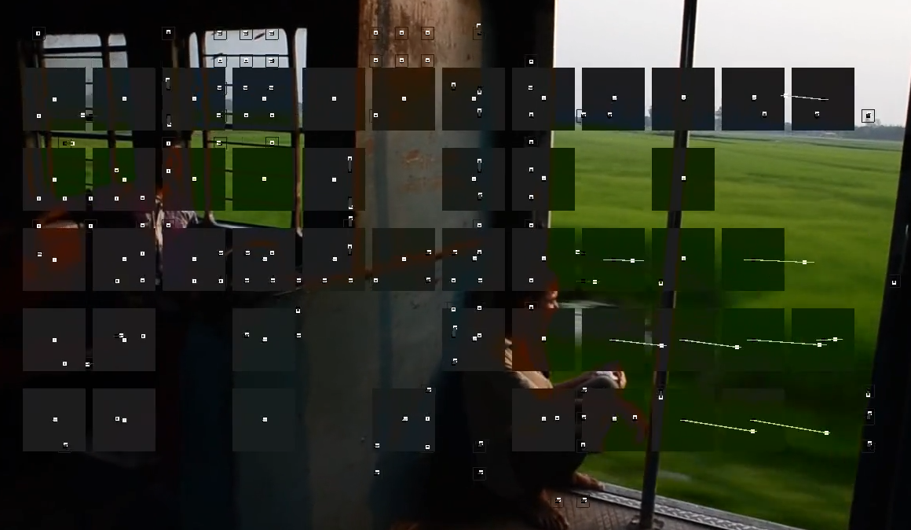

   The filter will detect the motion in several points on video and tracks them 
   accordingly. 

To remove the shakes, let us apply the filter ::

	ffmpeg -y -i shaky-video.mkv -vf vidstabtransform -c:a copy stabilized.mkv

Explore more at https://github.com/georgmartius/vid.stab

Cutting a portion of video with audio
~~~~~~~~~~~~~~~~~~~~~~~~~~~~~~~~~~~~~

It is a simple straight forward step with ``FFmpeg``::

	ffmpeg -ss 00:00:00.00 -i sample-video.mkv -t 00:00:05.00 -acodec copy -vcodec copy 5sec-cut.mkv

Mute a portion of audio only
~~~~~~~~~~~~~~~~~~~~~~~~~~~~

It is again a straight forward step ::

	ffmpeg -i sample-video.mp4 -af "volume=enable='between(t,1,3)':volume=0 mute-1-3s.mp4

SOX and FFmpeg
--------------

Audio noise reduction using ``sox``
~~~~~~~~~~~~~~~~~~~~~~~~~~~~~~~~~~~

Similar to video stabilization, noise reduction is also a 2 step process. 

#. Detecting noise
#. Applying filter to minimize

Let us first extract audio from video ::

	ffmpeg -i noisy-video.ogv -vn noisy-audio.ogg

Now, let us obtain the noise profile ::

	sox noisy-audio.ogg -n trim 0 1 noiseprof myprofile

This will analyze audio from 0 to 1 second and create a noise profile. 

To reduce noise to entire audio, we need to apply sox again with our detected 
noise profile. ::

	sox noisy-audio.ogg noisefree.ogg noisered myprofile 0.2

The ``0.2`` value is for moderate noise reduction in a scale of 0 to 1. 

Now, we can mux the audio-video files ::

	ffmpeg  -i noisefree.ogg -i noisy-video.ogv noisefree.ogv

Audacity
--------

Audacity is a free, easy-to-use, cross platform, cross architecture, multi-track audio editor.

The UI is simple and easy to navigate. 

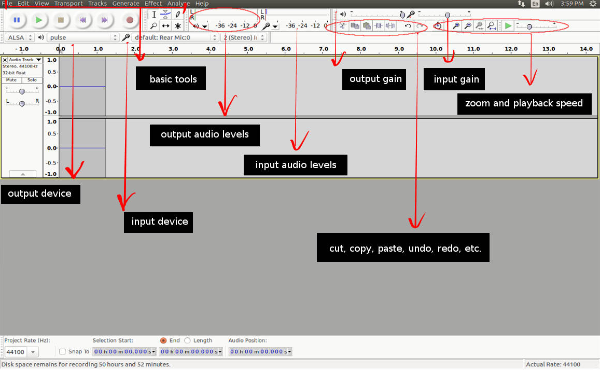

   Audacity UI `source image <http://creversely.com/blog/ui-crit4/audacity-btns.jpg>`_

Noise reduction using Audacity
~~~~~~~~~~~~~~~~~~~~~~~~~~~~~~

Noise reduction is fairly simple due to visual navigation. However, it
is still a 2 step process. 

#. Getting the noise profile
#. Noise reduction

Let us begin with getting the noise profile. Import the audio to timeline, select
a portion of noise. 

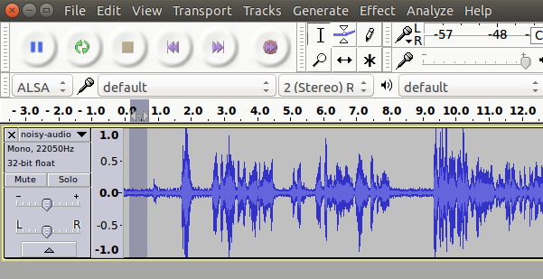

   Select small portion of noise for creating noise profile

Now, go to ``Menu -> Effect -> Noise Reduction`` and select get ``Get Noise Profile``

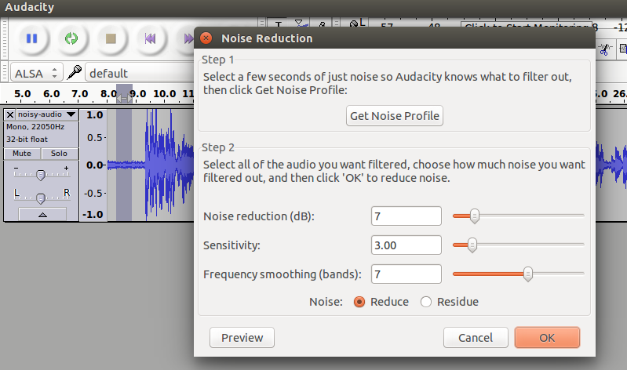

   Get the noise profile

You may adjust ``Noise Reduction(dB)`` to control the noise reduction factor, where ``0``
being no reduction and ``48`` is the maximum on the scale. 

Now, select the portion of video you want to reduce noise, or else you may do a ``cntl+a`` to
select the entire audio strip for noise reduction. 

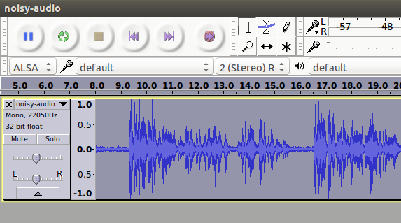

   Applying noise reduction on entire audio strip

The noise reduction is complete. You may select ``File -> Export Audio`` to save the modifications
in your desired format. 

Enhancing the audio quality
~~~~~~~~~~~~~~~~~~~~~~~~~~~

There are several effects under ``Menu -> Effect`` to enhance our audio. 

For vocals, I usually prefer the following. 

#. ``Menu -> Effect -> Normalize`` and select ``Ok`` with default settings, this
   will bring the audio amplification to an optmized level. 

#. ``Menu -> Effect -> Bass & Treble`` and preview your settings for your optimum
   voice. 

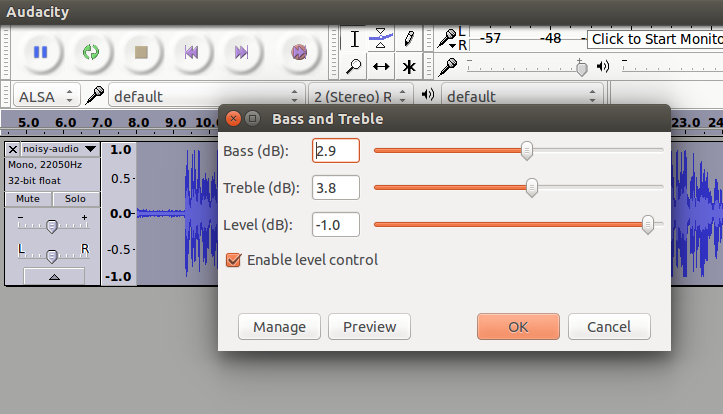

   Adjusting Bass/Treble 

#. ``Menu -> Effect -> Leveler`` will normalize the audio. It will try to make an 
   average peak level. 

#. There are many filters which can be applied on audio to make it more appealing or
   dramatic. The ``Change Pitch`` & ``Reverb`` may also be useful for vocals.

Blender as video editor
-----------------------

`Blender <https://www.blender.org/>`_ is the free and open source 3D creation suite. It supports the entirety of
the 3D pipeline—modeling, rigging, animation, simulation, rendering, compositing and 
motion tracking, **even video editing** and game creation.

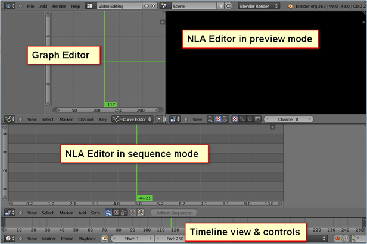

   Default video editing screen layout `source <http://www.gamefromscratch.com/image.axd?picture=072712_1737_TutorialSim2.png>`_

Basic operations on VSE (video sequence editor)
~~~~~~~~~~~~~~~~~~~~~~~~~~~~~~~~~~~~~~~~~~~~~~~

Adding a media
^^^^^^^^^^^^^^

Press ``shift a`` to add a media file to ``Sequence editor`` 

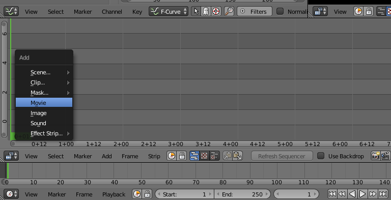

   Adding a media file to blender's NLA VSE

Once added ``blender`` will demux and show audio and video strips separately. 
We may select each strip ``Right click`` or ``RMB`` and press ``n`` by keeping the cursor
inside the ``VSE`` to access the properties and minor adjustments. 

The ``Left click`` on the strip will bring the green color ``cursor`` to the position
we want. 

Playing a strip
^^^^^^^^^^^^^^^

With curson on VSE press ``alt a`` to toggle ``play`` and ``pause``.

Cutting a strip (Trimming)
^^^^^^^^^^^^^^^^^^^^^^^^^^

Right click and select the strip and then left click to bring the cursor the cut location.
Enter ``k`` to cut at the location. 

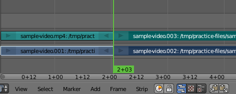

   Trimming a strip

Deleting a strip
^^^^^^^^^^^^^^^^

Select the strip and press ``x`` to delete

Moving the strips
^^^^^^^^^^^^^^^^^

Select one or more strips by holding ``shift`` key and ``RMB``. Select
``g`` to group them together and move the cursor to rearrange the strip.

Adding a transform Effect strip
^^^^^^^^^^^^^^^^^^^^^^^^^^^^^^^

Select the video strip and press ``shift a`` inside ``VSE`` to select ``Transfor Effect strip``.
Tweak the various transformations allowed by this strip by accessing the properties window on 
right hand side. 

Adding a text Effect strip
^^^^^^^^^^^^^^^^^^^^^^^^^^

Press ``shift a`` by keeping the cursor inside ``VSE`` and select ``text`` Effect strip.

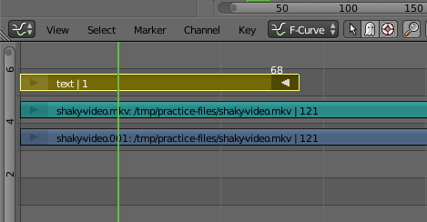

   Adding a text overlay on video

Exporting video
^^^^^^^^^^^^^^^

Change one of the window to ``Properties`` and modify your export settings. 

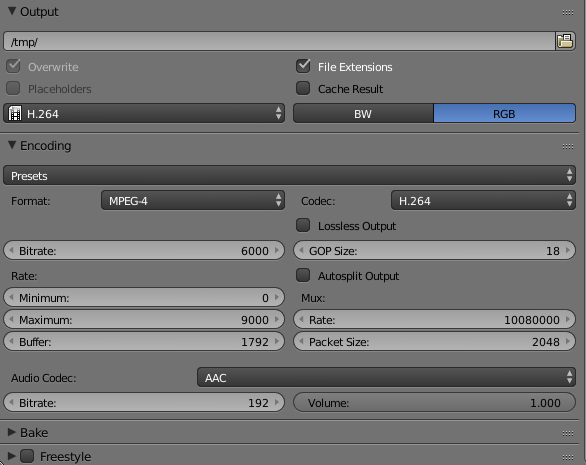

   Exporting to mp4

Suggested readings and credits
------------------------------

#. https://ffmpeg.org/ffmpeg.html

#. http://sox.sourceforge.net/sox.html

#. http://manual.audacityteam.org/

#. https://www.blender.org/manual/pt/editors/sequencer/index.html

#. https://www.youtube.com/playlist?list=PLjyuVPBuorqIhlqZtoIvnAVQ3x18sNev4

