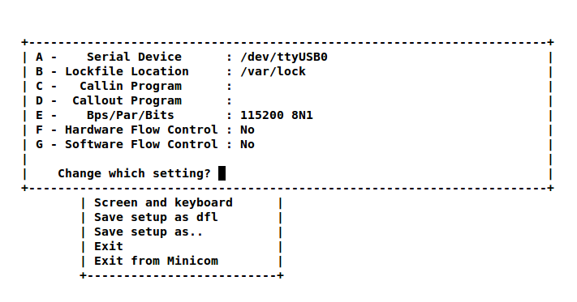
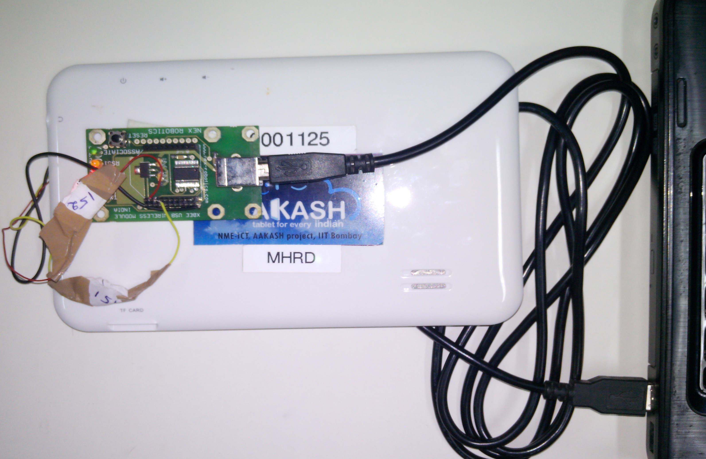
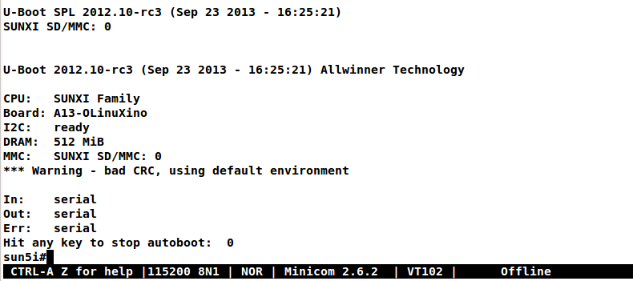
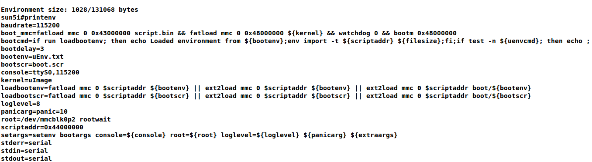

==============================
Embedded Linux & Open hardware
==============================

.. contents::

.. section-numbering::

.. raw:: pdf

   PageBreak oneColumn

.. footer::
   
   Page: ###Page###/###Total###,
   Embedded Linux Workshop, IIT Bombay

|

Embedded Linux(EL) 
------------------

What is Embedded Linux ?
~~~~~~~~~~~~~~~~~~~~~~~~

Embedded Linux is the use of Linux in embedded computer systems such as mobile 
phones, personal digital assistants (PDA), media players, set-top boxes, and 
other consumer electronics devices, networking equipment, machine control, 
industrial automation, navigation equipment and medical instruments. (Wiki)

Practically *EL* devices are no different from any regular desktop Linux,
except the fact that most of the input/output, sound/video/graphics components
are embedded in one IC(integrated circuit), also known as System on Chip(SoC).

Why Embedded Linux ?
~~~~~~~~~~~~~~~~~~~~

* Linux is a free software(free as freedom), it supports large variants of 
  embedded processors.

* Linux can be optimized to run on any low profile hardware(with 5MB ROM/RAM),
  as resources can be easily configured using userspace scripts. 

* The kernel device drivers are modular, and can be loaded at runtime without restarting OS.

* The most of the core kernel code is architecture independent, so it is easy to add support for
  new processor.

* There is no fee, no renewals, no hidden clauses

The production cost per *SoC* has now become as low as 10$, which enables low 
cost embedded Linux devices. Android is also an embedded Linux device. 

ARM based Embedded Linux
~~~~~~~~~~~~~~~~~~~~~~~~

**ARM (Advanced RISC Machines)** is the most actively developed, low cost, low 
power embedded processor available in both 32bit & 64bit versions. ARM based 
SoCs are manufactured by Samsung, Texas Instruments, ATMEL, NVIDIA, Apple,
Qualcomm and more. 

Beyond ARM, the other notable embedded processors are SUN-SPARC, MIPS, PowerPC,
Zilog, AVR, and more.

We will install toolchain and perform development for ARM processors only. 
Similar approach can be adopted for any other architectures too. 

|

**Layman comparision of ARM & x86 (2013 approximate price)**

==============      =========   ===============
 Entity              x86(i3)     ARM(Cortex-A8) 
==============      =========   ===============
Processor/SoC        107$      	  11$
RAM(1GB/DDR3)         15$          5$ 
ROM(SSD/NAND)        60$(60G)      4$(4G)  
Graphics             20$           NA
Power usage          high          low 
Size(Board)          10"x10"      4"x2"
==============      =========   ===============

Today, it is cheaper to deploy a quad core ARM based web-server than its x86 
counterpart. With better speed, small size  & low power consumption, ARM boards
are turning out to be real threat for desktop processors. 

|

**ARM architecture based Open hardware Embedded Linux boards**

==============   ======================================     ===================   
 Board name        Company / ARM type / Core(s)              Approximate Price       
==============   ======================================     ===================   
Raspberry-Pi      Broadcom BCM2835, ARM11, 1                     25$          
BeagleBone(B)     TI OMAP 3, Cortex-A8, 1                        45$          
PandaBoard        TI OMAP 4, Cortex-A9, 2                       182$          
WandBoard         Freescale, Cortex-A9, 1,2,4                  79$ (1 core)          
Cubieboard2       Allwinner A-20, Cortex-A7, 2                   59$      
A13-OLINUXINO     Allwinner A-13(Aakash), Cortex-A8, 1           47$       		
==============   ======================================     ===================   

|

**Companies using ARM architecture**

==============   ==================   =============================================  ======================
 Company           SoC Name                   Notable products                          ARM type / Core(s) 
==============   ==================   =============================================  ======================
Apple              A4                  iPhone4, iPad(1G), AppleTV(2G)                    Cortex-A8, 1                  
Apple              A5                  iPhone4S, iPad2, AppleTV(3G)                      Cortex-A9, 2
Apple              A7                  iPhone5s                                          Cortex-A7, 64bit          
Samsung            Exynos 3 Single     Samsung Galaxy S, Galaxy Nexus S                  Cortex-A8, 1
Samsung            Exynos 4 Dual       Samsung Galaxy SII, Samsung Galaxy Note           Cortex-A9, 2
Samsung            Exynos 4 Quad       Samsung Galaxy SIII                               Cortex-A9. 4
Nvidia             Tegra               Microsoft Zune HD                                 ARM11, 1
Nvidia             Tegra 2             ASUS Transformer, GalaxyTab 10.1                  Cortex-A9, 2
Nvidia             Tegra 3             ASUS Nexus 7, HTC One X                           Cortex-A9, 4
Qualcomm           Snapdragon S2       Nokia Lumia 900                                   NA, 1
Qualcomm           Snapdragon S3       HP TouchPad                                       NA, 2
Qualcomm           Snapdragon S4       HTC EVO 4G LTE                                    NA, 2
TI                 Omap 3              Barnes and Noble Nook Color                       Cortex-A8, 1
TI                 Omap 4              KindleFire,GalaxyTab 2,Blackberry Playbook        Cortex-A9, 2
TI                 Omap 5              NA                                                Cortex-A15, 2 
==============   ==================   =============================================  ======================

|

Boot sequence in Linux
----------------------

**The steps involved in Linux boot process (x86 and ARM) :**

1. **BIOS (assembly & C)** - is the first program run by x86 based motherboard. ARM boards do 
   not have BIOS, but each SoC has its own program to verify the on-board peripherals 
   after power on. 

   This BIOS equivalent program in EL is mostly hardcoded in SoCs, hence updating them
   is usually not possible in case of embedded devices. 

   The purpose of this stage is to check the integrety of peripherals connected,
   if found OK, it will look for `bootloader` application in first boot-able device.
   

#. **Bootloader (C & assembly)** - is used to copy and uncompress *kernel* to RAM from a given 
   location. GRUB(GRand Unified Bootloader) is the popular bootloader for desktop 
   Linux machines. 

   Embedded Linux uses `U-Boot <http://www.denx.de/wiki/U-Boot/>`_ bootloader.

#. **Kernel (C & assembly)** - again probes all connected hardware and initializes 
   them systematically. At the end of the kernel stage, it calls *init* process
   from filesystem to initialize user space scripts and startup jobs. 

#. **Initrd (initial ramdisk)** - is an optional scheme for loading a temporary 
   root file system containing device drivers into memory in the boot process of 
   the Linux kernel. 

#. **File-system** - is the last stage of boot process, it contains *glibc* and 
   other architecture specific shared libraries to run user space applications. 

   Filesystem optionally may contains X-server which provides graphical desktop
   environment such as GNOME, KDE etc. 

|

Setting up development environment
----------------------------------

Software requirements
~~~~~~~~~~~~~~~~~~~~~

#. In Ubuntu 12.04+, issue the below command to install cross compiler ::

	sudo apt-get install gcc-arm-linux-gnueabihf

#. Install dependencies for kernel and u-boot compilation ::

	sudo apt-get install build-essential dpkg-dev kernel-wedge make automake\
    	checkinstall git u-boot-tools

#. Install ``qemu-user-static`` for setting up chroot based ARM virtualization to
   install packages in ARM-fileystem ::

	sudo apt-get install qemu-user-static

#. If you have serial console (Rx, Tx) lines from the board/tablet, then to  
   view console output install *minicom* (optional) ::

	sudo apt-get install minicom

Hardware requirements
~~~~~~~~~~~~~~~~~~~~~

#. A development board such as R-pi, beagleboard, cubieboard or Aakash tablet

#. An sdcard of 2 GB or above

#. USB hub, keyboard and mouse (optional)

#. Serial(Rx,Tx) cable, and USB to serial convertor (optional, for debugging)  

|

Preparing U-boot, kernel & filesystem 
-------------------------------------

At the end of this stage you will have a bootable sdcard with your custom
embedded Linux.

For those who want to try Linux on Aakash now, can download this sdcard 
`image <http://www.it.iitb.ac.in/AakashApps/repo/GNU-Linux-on-Aakash/13.10_2GB_24_09_2013.img.bz2>`_

Insert the sdcard and umount ::

	umount /dev/sdX

Untar the file and ``dd`` it to sdcard ::

	sudo dd if=13.10_2GB_24_09_2013.img of=/dev/sdX bs=1M count=2048

U-Boot 
~~~~~~

Compiling U-boot
^^^^^^^^^^^^^^^^

1. Clone the repository by ::
    
    git clone -b sunxi https://github.com/androportal/uboot-allwinner.git \
     --depth=1

#. ``cd`` into ``uboot-allwinner`` ::

	cd uboot-allwinner

#.  To compile uboot issue ::

     make a13_olinuxino CROSS_COMPILE=arm-linux-gnueabihf-

#.  After successful compilation ``u-boot.bin`` will be available at root of the
    directory and ``sunxi-spl.bin`` will be in ``spl`` directory
    
|

Writing U-boot on sdcard
^^^^^^^^^^^^^^^^^^^^^^^^

**SDCARD layout**

=========      =========   =====================                                 
 Start            size          usage                                 
=========      =========   =====================                                 
0                 8KB         Unused                                           
8                24KB       Initial SPL loader                                            
32              512KB       u-boot                                       
544             128KB       environment                                             
672             352KB       reserved                                           
1024              --        free for partitions                           
=========      =========   =====================

|

1. Insert ``sdcard`` in card reader or MMC reader available in laptops/netbooks

#. Backup all your sdcard data, and issue the following commands carefully, replace 
   *X* in /dev/sdX with suitable letter(a lower case alphabet) alloted for your
   sdcard, remember *X* will never be *a* if you have a hard disk installed, so keep
   in mind it must be something like ``/dev/sdb`` or ``/dev/sdc`` etc. Please check
   twice and if you are still unsure then do not perform these steps ::

        sudo fdisk -u=sectors /dev/sdX

#. First clear the previous u-boot and its configurations, if any::

		sudo dd if=/dev/zero of=/dev/sdX bs=1024 seek=544 count=128

#. Now from same ``uboot-allwinner`` directory issue these commands, again replace 
   X with suitable value, now to write ``sunxi-spl.bin`` to sdcard issue::

        sudo dd if=spl/sunxi-spl.bin of=/dev/sdX bs=1024 seek=8

   Similarly to burn ``u-boot.bin`` issue ::

        sudo dd if=u-boot.bin of=/dev/sdX bs=1024 seek=32

At this point we have a bootable sdcard readly. Get kernel and rootfs to make a usuable
Linux for your tablet.

|

Kernel 
~~~~~~

Compiling Kernel
^^^^^^^^^^^^^^^^

Kernel compilation steps are same for 

1. Clone the repository by ::
    
        git clone https://github.com/androportal/linux-sunxi.git

#. ``cd`` into ``linux-sunxi`` ::

        cd linux-sunxi

#. Checkout to desired branch, it this case ``sunxi-3.0``::

        git checkout sunxi-3.0

#. You may use the existing `.config <https://raw.github.com/androportal/linux-sunxi/sunxi-3.0/.config>`_ file 
   to compile the kernel for Aakash, or customize it using standard procedures. 

   ``.config`` contains all settings and modules information set by user for specific hardware. This will 
   differ from board to board. A ``.config`` file is autogenerated and can be customized later by following 
   commands. 
   The next command will create a default ``.config`` for A13(Aakash) board, do not run the next command
   if you have already downloaded the ``.config`` file from above link, otherwise it will overwrite without 
   any warning ::

        make ARCH=arm a13_defconfig

#. To customize or view the settings you may run the following command(optional) ::

	make ARCH=arm menuconfig

   .. image:: data/menuconfig.png
      :width: 100%   

   To search any module or setting use ``'/'``

   .. image:: data/search.png                                               
      :width: 100%	

   To get module help use ``'?'`` when selected

   .. image:: data/module-help.png                                               
      :width: 100%

   Use space-bar to toggle ``'M'`` (as module) or ``'*'`` (build in kernel)  

   .. image:: data/modules-selection.png                                               
      :width: 100%	
 
   Use arrow keys to select ``exit``, and choose ``yes`` to save the new ``.config`` file 

   .. image:: data/config-save.png                                               
      :width: 100%	

#. Now to compile kernel issue ::

        make ARCH=arm CROSS_COMPILE=arm-linux-gnueabihf- uImage

#. To make kernel modules ::
        
        make ARCH=arm CROSS_COMPILE=arm-linux-gnueabihf- \ 
        INSTALL_MOD_PATH=out modules

#. To install modules in right path ::

		make ARCH=arm CROSS_COMPILE=arm-linux-gnueabihf- INSTALL_MOD_PATH=out \
   	   	modules_install

#.  After successful compilation ``uImage`` will be available at ``arch/arm/boot/uImage`` and
    also find ``script.bin`` in the root of the directory(This section is subject to change), the
    kernel modules are available at ``out/lib/modules/3.0.76+/`` 
    

Copying kernel to sdcard
^^^^^^^^^^^^^^^^^^^^^^^^

1. Insert ``sdcard`` in card reader or MMC reader available in laptops/netbooks

#. Backup all your sdcard data, and issue the following commands carefully, replace 
   *X* in /dev/sdX with suitable letter(a lower case alphabet) alloted for your
   sdcard, remember *X* will never be *a* if you have a hard disk installed, so keep
   in mind it must be something like ``/dev/sdb`` or /``dev/sdc`` etc. Please check
   twice and if you are still unsure leave this README right now otherwise you may 
   end up with non bootable machine::

        sudo fdisk -u=sectors /dev/sdX

#. Then create partition for kernel and filesystem in your sdcard, from 
   inside ``fdisk`` prompt type ``p`` to list all partitions ::

        Command (m for help): p

#. Now press ``d`` to delete your partition. If you have multiple partitions use partition number
   to delete each partition as shown by fdisk utility::
        
        Command (m for help): d

#. Type ``n`` for new partion(hit enter) and then mention ``p`` for primary partition, hit 
   enter to continue with default starting sector(2048), enter again for last sector and  
   mention ``+16M``, this partition will be later formatted with vfat for kernel::

        Command (m for help): n
        Partition type:
           p   primary (0 primary, 0 extended, 4 free)
           e   extended
        Select (default p): p
        Partition number (1-4, default 1): 
        Using default value 1
        First sector (2048-7744511, default 2048): 
        Using default value 2048
        Last sector, +sectors or +size{K,M,G} (2048-7744511, default 7744511): +16M
 
#. The sdcard is assumed to be 4gb size, similarly create 2nd primary partition 
   using remaining disk space which will serve as filesystem::

        Command (m for help): n
        Partition type:
           p   primary (1 primary, 0 extended, 3 free)
           e   extended
        Select (default p): p
        Partition number (1-4, default 2): 
        Using default value 2
        First sector (34816-7744511, default 34816): 
        Using default value 34816
        Last sector, +sectors or +size{K,M,G} (34816-7744511, default 7744511): 
        Using default value 7744511

#. (Optional) If you intend to use ``swap`` partion, leave atleast ~300MB in 
   previous step and create a 3rd primary partition.

#. Now as we have created 2 primary partitions now let's write(w) the changes 
   to disk. For that issue::

        Command (m for help): w

#. As partition is completed, we need to format them respectively, the first 
   partition must be vfat so that uboot can read kernel::

        sudo mkfs.vfat /dev/sdX1

   For rootfs, create ext4 partition::

        sudo mkfs.ext4  /dev/sdX2
        
        
#. Now mount vfat partition to some mount point(directory)::

        sudo mount -t vfat /dev/sdX1 /mnt/boot

   copy kernel to ``/mnt/boot``, assuming that you are still in ``linux-sunxi`` directory::

        sudo cp arch/arm/boot/uImage /mnt/boot

   
   Also copy ``script.bin`` to same directory(script.bin must be extracted from android 
   partition) ::

        sudo cp script.bin /mnt/boot

   
   Now, umount /mnt/boot, before that you may want to ``sync`` so that any 
   remaining buffers are written to disks::

        sudo sync

   
   Finally unmount::

        sudo umount /mnt/boot

At this point we have a sdcard ready with kernel. Copy rootfs 
to make a usuable Linux for your hardware. 

|
|
|

Filesystem
~~~~~~~~~~

As of now we have uboot and kernel ready, the next step is to run applications, to
do so we need Linux file system. One can use any distribuition from here after.
For this session we will use ubuntu 13.10 daily build. You can upgrade to stable
13.10 later. 

We will use LXDE, as it is almost 50% lighter & twice as faster than any other 
desktop environment.

Setting up ARM chroot 
^^^^^^^^^^^^^^^^^^^^^

#. Insert sdcard again, download the core ubuntu 13.10 image from this `link <http://cdimage.ubuntu.com/ubuntu-core/daily/current/saucy-core-armhf.tar.gz>`_ and save it in say `/tmp` directory. Extract the tar file in your sdcard's ext4 partition ::
	
	cd /media/<ext4 partition of sdcard>

   Now extract core ubuntu file system ::

	sudo tar -xvpzhf /tmp/saucy-core-armhf.tar.gz

#. Copy the static qemu binary to mount arm fs in x86 architecture without invoking actual qemu emulator ::

	sudo cp /usr/bin/qemu-arm-static /media/<ext4 partion of sdcard>/usr/bin/

#. Now set up chroot environment manually or use the `ch-mount.sh` bash 
   script given two steps below ::

	sudo mount -t proc /proc /media/<ext4 partion of sdcard>/proc

	sudo mount -t sysfs /sys /media/<ext4 partion of sdcard>/sys

	sudo mount -o bind /dev /media/<ext4 partion of sdcard>/dev

	sudo mount -o bind /dev/pts /media/<ext4 partion of sdcard>/dev/pts

	
#. chroot into the file system ::

	
	sudo chroot /media/<ext4 partition of sdcard>/

#. The above two steps can be combined together using a simple bash
   `ch-mount.sh
   <https://github.com/psachin/bash_scripts/blob/master/ch-mount.sh>`_. From
   here onwards we will use this script to mount and un-mount
   fs. Please read this script to get any further help ::

	sudo bash ch-mount.sh -m /media/<ext4 partition of sdcard>/

Updating and installing packages
^^^^^^^^^^^^^^^^^^^^^^^^^^^^^^^^

#. Now we have a chroot environment with all ``proc, dev, sys, dev/pts`` mounted,
   so run update to fetch repository informations (as chroot has root prompt so
   no need to write sudo anymore) ::

	apt-get update

#. Open ``/media/<ext4 partition of sdcard>/etc/apt/sources.list`` in text\
   editor and replace the content with following ::

	deb http://ports.ubuntu.com/ubuntu-ports/ saucy main universe
	deb http://ports.ubuntu.com/ubuntu-ports/ saucy multiverse restricted
	deb-src http://ports.ubuntu.com/ubuntu-ports/ saucy main universe
	deb-src http://ports.ubuntu.com/ubuntu-ports/ saucy multiverse restricted

#. Now install english language pack to avoid locale related errors ::

         apt-get install language-pack-en-base

#. Now install minimal X environment to test our setup ::

	apt-get install vim.tiny sudo ssh net-tools ethtool wireless-tools lxde \    
         xfce4-power-manager xinit xorg network-manager iputils-ping \
         florence rsyslog alsa-utils gnome-mplayer \

#. Few optional recommended packages for system utilities(lxtask, lxproxy and htop) ::

	apt-get install bash-completion lxtask htop \ 
	python-central python-gobject-2 python-gtk2 synaptic\

   Download `lxproxy <http://zevenos.com/files/lxproxy_0.1ubuntu3_all.deb>`_ and install using dpkg::

	dpkg -i lxproxy_0.1ubuntu3_all.deb

#. Few more optional packages for office suite, arduino development and pcb designing (testing purpuse)::

	apt-get install libreoffice python-gnome2 python-gconf python-serial\
	python-gtksourceview2 gcc-avr  binutils-avr  avr-libc avrdude python-xdg

   Download  `gnoduiono <https://launchpad.net/~pmjdebruijn/+archive/gnoduino-release/+files/gnoduino_0.4.0-0pmjdebruijn4%7Eprecise_all.deb>`_ and install using dpkg::

	dpkg -i gnoduino_0.4.0-0pmjdebruijn4~precise_all.deb
	
User permissions and startup jobs         
^^^^^^^^^^^^^^^^^^^^^^^^^^^^^^^^^

#. Add user and set permissions ::

    adduser aakash && addgroup aakash adm && addgroup aakash sudo && \ 
    addgroup aakash audio

#. Open ``/etc/hostname`` file in vim.tiny editor and give a hostname, for example
   write ``aakash-arm``

#. Similarly open ``/etc/hosts`` and remove its content and add these two lines::

	127.0.0.1    localhost
	127.0.1.1    aakash-arm

#. Open ``/etc/modules`` file and append these two lines ::

    gt811_ts
    ft5x_ts
    ektf2k
    8192cu

#. Add these lines in ``/etc/rc.local`` to activate swap at boot time(if using)::

	# Added for Aakash, assuming the last partition will be swap 
	mkswap /dev/mmcblk0p3
	swapon /dev/mmcblk0p3

#. To allow non root user to edit networking, change this file ::

	/usr/share/polkit-1/actions/org.freedesktop.NetworkManager.policy

	look for this section:
	<action id="org.freedesktop.NetworkManager.settings.modify.system">
	
	change <allow_active> to 'yes':
	<defaults>
	<allow_inactive>no</allow_inactive>
	<allow_active>yes</allow_active>
	</defaults>
	</action>

#. Open ``/etc/lxdm/lxdm.conf`` and modify it for autologin. Change the autologin
   section in the top of the file to this ::

	## uncomment and set autologin username to enable autologin
	autologin=aakash

#. Now open a new tab in your host Linux machine's terminal and copy
   ``/<path to linux kernel>/linux-sunxi/out/lib/modules/3.0.76+/`` to your arm
   ubuntu setup ::

       sudo cp -r /<path to linux kernel>/linux-sunxi/out/lib/modules/3.0.76+/ \
       /media/<ext4 partition of sdcard>/lib/modules/

#. Download rtl8192cufw.bin from this
   `page <http://mirrors.arizona.edu/raspbmc/downloads/bin/lib/wifi/rtlwifi/>`_,
   and create a directory as ``/lib/firmware/rtlwifi`` in ubuntu chroot, copy
   ``rtl8192cufw.bin`` inside ``rtlwifi`` directory

#. By now we have basic elements set to give a trial run to our OS. Type
   ``exit`` in chroot environment to get back to Ubuntu x86 host prompt, now
   run un-mount script ::

	sudo bash ch-mount.sh -u /media/<ext4 partition of sdcard>/

   unmount both the partitions (fat32 and ext4) from your machine, confirm with
   ``mount`` command to check nothing from sdcard is mounted

Remove the sdcard and insert it in your tablet, power on to get ubuntu 13.10 lxde desktop

Debugging 
---------

U-boot access using minicom
~~~~~~~~~~~~~~~~~~~~~~~~~~~

``Minicom`` is a serial communication program, its used to access serial console 
at certain baudrate us Rx & Tx lines. The serial console redirects the output
of embedded Linux device to minicom. Mostly embedded devices do not have display
units, hence serial debugging is one of the widely used practice. 

Minicom setup
^^^^^^^^^^^^^

Set the proper baud rate and port. The baud rate could be ``115200`` in most cases,
if not check the manual of the SoC. 

Run ::

	sudo minicom -s

and then navigate to ``Serial port setup`` and change settings to match as shown below,
hit enter to exit, then ``Save setup as dfl``.

Connect Rx, Tx lines to your embedded board and other end to your host laptop/desktop. 

|

Now run ::

	minicom

and you should see scrolling U-boot and kernel logs. By default U-boot waits 
for user interrupt for 3 seconds. If interrupted it will drop into U-boot prompt, similar
to this

You can type ``help`` to see all `U-boot` commands. 

To print default U-boot environment variables ::

	printenv

|

U-boot prompt can allow user to update kernel, load alternate kernel images, 
change the environment variables and lot more. 

Now to ``boot`` the kernel from U-boot prompt just run ::

	boot

This will boot the default kernel set in U-boot environment. 

Kernel debugging
~~~~~~~~~~~~~~~~

The kernel logs can be viewed in same minicom serial console. The logs provide
important information about services and drivers. One can set loglevel to control
the extent of debug info on screen. 

Developers usually insert ``printk`` statements in device drivers and check values of 
variables in kernel log. The better and efficient way to debug kernel is by using
``kdb``. More on kdb can be found `here <https://www.kernel.org/pub/linux/kernel/people/jwessel/kdb/>`_

Additional tools to make life easy
----------------------------------

ssh & scp
~~~~~~~~~

Setup an ssh server in your embedded Linux box and add your public key to have
password less login (helps to load kernel images and modules faster)

tftp server
~~~~~~~~~~~

If your board supports ethernet cable then use this setup to transfer test builds. 

