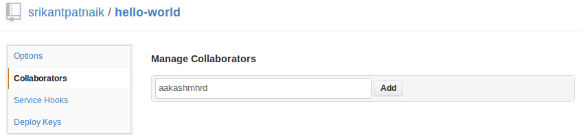
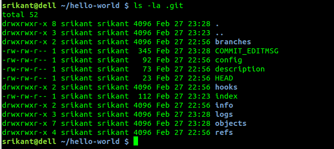

===============
VERSION CONTROL
===============

.. contents::

.. section-numbering::

.. raw:: pdf

   PageBreak oneColumn

.. footer::
   
   Page: ###Page###/###Total###,
   Android workshop, Saturday 2nd March 2013, IIT Bombay 

Version control, also known as revision control or source control, is the
management of changes to documents, computer programs, large web sites, 
and other collections of information.

|

Not a version control 
---------------------

Generally people confuse software versions with *version control*. They are not
exactly same. For example, software version of LibreOffice-3.6.2 has nothing 
to do with term version control. 

|
|

Why version control?
--------------------

Why we keep track of our spendings, why we try to manage our files in computer?
Version control is a generic process given to tools which we use to manage
source code or files. 

Version control systems provide you with three important capabilities [#]_ :

**Reversibility:** the ability to back up to a previous state, if you discover
that some modification you did was a mistake or a bad idea.

**Concurrency:** the ability to have many people modifying the same collection 
of files, knowing that conflicting modifications can be detected and resolved.

**History:** the ability to attach historical details to your data, such as 
explanatory comments about the intention behind each change. Even for a
programmer working solo, change histories are an important aid to memory; 
for a multi-person project, they are a vitally important form of communication
among developers.

Almost all software applications are managed by some type of version 
control system.

:: 
    
    We will focus on git version control, which is fast, robust, and most 
    popular tool around. Git written by Linus Torvalds to maintain Linux 
    kernel. 

.. [#] `www.gnu.org  <http://www.gnu.org/software/emacs/manual/html_node/emacs
                     /Why-Version-Control_003f.html#Why-Version-Control_003f>`_

|
|

Git version control with simple hello world project 
---------------------------------------------------

Assuming git is already installed on your machine. 

.. .. |logo.png| image:: data/logo.png 
			  :width: 30%
	
Use **git <command> --help** or **man git** or **man git <command>**  for 
quick reference. 

#. Create a directory say `hello-world` in your `HOME` directory and `cd` ::

        mkdir hello-world 

   then ::

	    cd hello-world

#. It is good practice to compose a README file, before writing any logic. 
   Let's create a file README.rst in present working directory with following
   content

   .. code-block:: none
      :linenos:
    
	README
	======

	What is this project for ?
	--------------------------

	This project will create a binary executable file which when invoked will
	print **Hello World** on the terminal.

	Prerequisites
	-------------

	* GCC (GNU Compiler collection)

	How to use
	----------

	Compile the source file and generate binary executable *hello* ::

	   gcc hello_world.c -o hello

	Then execute ::

	   ./hello

#. As README file is in place, let's initialize *git* in this directory ::

		git init

   The above command will create an empty git repository in `hello-world` 
   directory. 

   
#. Now, as the repository is initialized, let's add our file to this 
   repository ::

		git add README.rst

#. As README.rst file has been added to repository, *git* will start
   tracking changes to this file, but it won't save any of those changes 
   to repository. 

   User has to invoke `git commit` command, to save the state of tracked files. 
   `git commit` will also prompt for commit message, a commit message is
   essentially a short description about the important changes ::

		git commit 
   
|

   .. image:: data/commit-msg.png
	  :width: 100%

   Give meaningful description as commit message, as shown in the figure
   above. Assuming your default editor as GNU/nano press `Control + o` and 
   `Enter`, to save and then `Control + x`, to exit. You can change this editor 
   preference later. 

   Congratulations, you have successfully set `git` for your hello world
   project. 

   So, in short we did only these 3 steps

   **git init**  -->  **git add <file(s)>**  -->  **git commit**

   and that's all about **basic git**.
	
   |	

   NOTE: To remove any file from **git repository**, use ::

		git rm <filename>

| 
|

More practical use of git
-------------------------

So far, we have seen **git init**, **git add** and **git commit**. This is only
good enough for local repositories and single user projects but practically,
we need more of git to manage project effectively. 

In a condition where you want a team to work simultaneously on various
parts of the project, it's better to host your project online.

|
|

Benefits of git on server compared to local git repository
~~~~~~~~~~~~~~~~~~~~~~~~~~~~~~~~~~~~~~~~~~~~~~~~~~~~~~~~~~

* One can access code from heaven/hell.

* Easy to share with concerned people.

* People can report bug(s), or raise issues.

* Easy to add or remove contributors.

|
|

Pushing project to server
~~~~~~~~~~~~~~~~~~~~~~~~~

There are many git hosting websites, such as 
`gitourious.org <http://gitorious.org/>`_,\
`bitbucket.org <http://bitbucket.org/>`_,\
`sourceforge.net <http://sourceforge.net/>`_ etc. 

We will choose `github.com <http://github.com/>`_, which is reliable, fast
and widely used. Most of the large projects can be found on github, including
Linux kernel. 

.. image:: data/data_flow.png
   :width: 50%

source: Wikipedia.org

So what must we do to push our `hello world` project online?

#. Create a free account on github.com, and login.

#. Initiate process to create new repository by clicking first option next to 
   username on the top right corner of web page.

..   .. |create-repo| image:: data/create-repo.png
   	  :width: 50%
 
#. Give your local git directory name as your repository name, in our case it 
   is **hello-world**. Enter a brief description about the project. When all set,
   create repository. See fig 

   .. image:: data/create-repo-name.png
      :width: 90%

#. A new page with two options will be displayed. We will choose the second 
   option `Push an existing repository from the command line`, which
   is true in our case. See fig

   .. image:: data/github-repo-instructions.png
      :width: 100%

#. Copy the git remote command and paste it on your terminal. This will add 
   server address to be used by local repository to push changes to github. 

   .. image:: data/git-remote-add.png
      :width: 100%

#. Almost done. Now we need to push changes to server, **git push -u \
   origin master** command will ask for your username and password of github
   account. When you enter there successfully, you will see your repository online.

   .. image:: data/git-push.png
      :width: 100%

Remember, you **need not** to open github web page to push changes every time.  

|
|
|

Adding collaborators to project
~~~~~~~~~~~~~~~~~~~~~~~~~~~~~~~

So our project is online, let's add collaborators. As project admin, we can 
add as many as required. Once added, all collaborators will have read-write
access to **hello-world** repository only.

Let's continue with our `hello world` project, and extend it for multi-user 
and multi-file project. 

Let's add only one collaborator. Go to `Settings` tab on repository page and 
`Collaborators` option, and search for username to add. Refer fig

|
|

Splitting task and collaborator side
~~~~~~~~~~~~~~~~~~~~~~~~~~~~~~~~~~~~

It's a good practice to edit a file, by one person at a time.

Assume it was decided that user `srikantpatnaik` will only handle
documentation, and the only collaborator `aakashmhrd` will write code.

Steps to perform on collaborator side. 

#. Collaborator should first download the copy of the entire repository, 
   find url to clone at the top section of the github page ::

	git clone https://github.com/srikantpatnaik/hello-world.git

#. Now `cd` to `hello-world` directory ::

	cd hello-world

#. As decided, collaborator will create *hello_world.c* file with the following
   content

   .. code-block:: c
     :linenos:

      #include <stdio.h> 
      int main() {
         printf("Hello World\n");
         return 0;
      }

#. Add the newly created file to repository, and commit ::

      git add hello_world.c

   *git commit* will ask for username and email, as its the first time setup
   for `aakashmhrd`. Email and username **need not** be same as github.

   This is a standard step when you run git for the first time. You need to enter
   these credentials even if you don't ever push or communicate with any server

   .. image:: data/git-config-collaborator.png
      :width: 100%

   Now add information required by git to proceed ::

		git config --global user.email foo@nomail.com
 
   To add user name ::

        git config --global user.name "aakash mhrd"

#. Though it's optional, still `git status` is a useful command to grace. This
   will show the state of the repository ::

		git status

#. Now try  *git commit* again, and enter suitable commit message ::

		git commit

#. All set. Collaborator's initial job is done. Let's push back the changes
   to github server,  **git push** will again prompt for username and 
   password  ::
	
		git push

   Please **Remember** that this is just a demo to make you understand how multiple
   users work on github, performing both admin(srikantpatnaik) and collaborator
   (aakashmhrd) task by the same person is not at all required.

|
 
merge and reset
~~~~~~~~~~~~~~~

Let's get into more details.  

We know that collaborator(aakashmhrd) has pushed the changes to server but 
admin(srikantpatnaik) is unaware of those changes. 

|
|
|

merge
^^^^^

.. image:: data/git-collaboration-merge.png
   :width: 100%

#. Let us assume that admin is also going to make some changes in his README.rst 
   file.
 
   Open the README.rst file and append the following at the end of the file ::

		Thanks for using our hello world program. 

#. Again perform **git add** and  **git commit** as usual

   (or)
 
   as we only made update to file and didn't added any new file, we can use
   a shortcut for commit, `-a` will include all the updated files or deleted
   files from the staging area. If you want to insert inline commit 
   message(i.e without opening editor), you can simply use `-m` flag ::

		git commit -am "added thank you at the end of the file"

#. Now try pushing changes to server, `git push` 

   Error

   .. image:: data/git-push-failed.png
      :width: 100%
		
	
   Please read the error message carefully. Git error messages are self 
   explanatory. In the *hint* section ::

    	hint: Updates were rejected because the tip of your current branch is behind

   This tells that tip(latest commit) at server, is ahead of your local commit. 
   Which is true, `aakashmhrd` has pushed changes to server, which are not 
   present in `srikantpatnaik` version. 

   So what is the solution? 
   Well, it's always a good practice to do a **git pull** before an actual 
   push. The `git pull` will internally do `git fetch` and `git merge` ::

		git pull

   So as I mentioned, a **git pull**  will perform `git fetch` (download
   updated version from github) and `git merge` (join two or more development
   histories together).

   The above `git pull` command will ask you enter a commit message about 
   the necessity of the **merge**.

   .. image:: data/git-merge.png
     :width: 100%

   |
			
   This will create a new commit, try pushing the changes to github ::
 
		git push 

   Now it will work normally. One must remember to perform 
   a **git pull** before writing any meaningful code. 

| 
|
|
|
|
|
|
 
reset
^^^^^

In many situations, you might want to revert  to a particular version.
Let's try reverting our repository where we had only README.rst file(i.e
first commit).

Steps to follow:

#. To know all the `commit` history. Do ::

		git log --all --graph

   This will print all commits and respective commit messages, with latest
   commit at top. 

   To view all commits on master branch do ::

		git log master

#. To revert to previous version, one can track through commit message. See that's
   why commit message is important. In our case it says `Added README.rst file
   with instructions to compile and execute`.

#. To simply move our HEAD(latest commit) to commit corresponding to README.rst,
   we need to select its hash(SHA1) ::

		git reset --hard 8bfd59e

   This will reset repository head to first commit(i.e one with README.rst only).

#. Now `git log` will simply show the head at 8bfd59e (minimum first 7 digits 
   of hash are required to represent commit) ::

		git log

 
#. If we feel to push this modified state to github ::

		git push --force

   
#. If you feel to change the HEAD back to some other commit, then follow step 1,2 and 3 again.

Topics for self exploration
---------------------------

Git is a huge package to learn and practice.

We tried to cover only important and most frequently used options. 

It is recommended to explore these commands too.

* .gitignore

* git branch 

* git checkout

* git mv

* git tag

* git stash

|
|
|
|
|
|

How git works ?
---------------

A simple but important question, how does git work?

How it saves content? What makes it so fast even with hundreds of commits on
thousands of files. I won't be explaining in detail but will give
you at least, a glimpse of it. 

When committed, git actually stores a snapshot of entire project, it is similar
to taking a picture of all the files at that moment. If some files
have no changes, git doesn't store them again, it rather link them to the previous 
version. 

In the following figure, snapshot of each version is saved by git. For version-1
it saves all 3 files, for version-2 it saves only file **A1**, **C1** and links
file **B** to the previous version. 

.. image:: data/git-snapshot.png
   :width: 100%	

credits http://git-scm.com/book/en/Getting-Started-Git-Basics 	

If you are curious what is there inside your repository ::

   ls -la .git

The `.git/objects` directory will contain repository related files in 
non-readable and non-editable format. 

.. warning:: Never delete `.git` directory.

Suggested readings
------------------

#. http://git-scm.com/documentation 

#. http://git-scm.com/book

#. Practice git online - http://try.github.com/levels/1/challenges/1

