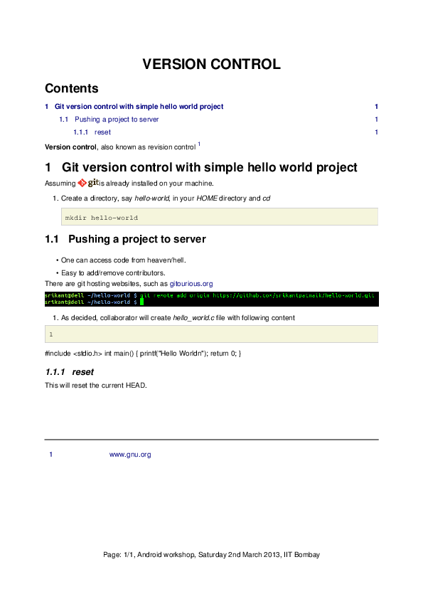

=================================================
ReStructured Text, export to pdf and html(sphinx)
=================================================

.. contents::

.. section-numbering::

.. raw:: pdf

   PageBreak oneColumn

.. footer::
   
   Page: ###Page###/###Total###,
   Android workshop, Saturday 2nd March 2013, IIT Bombay 

|
|

Why Documentation?
------------------

A major thing that matters in any software project is `documentaion`. It helps develop
a sense of trust and confidence.  

Without a proper documentation/manual, users tend to migrate. So, it is always true to say,

"`Documentation is more important than code`"

Companies like Google, Oracle, Microsoft, Apple, spend a large share of their 
development resources on user help content. 

The GNU project also provides excellent documentation. In any GNU/Linux machine
one can access it by ::

		man <command-name>

Here `man` stands for manual. 

Tools for writing documentation
-------------------------------

#. **Office Suite** (Microsoft Office or Open Office)

   Export to pdf and html, are available. 

#. **LaTeX(tex)**: is a document markup language and document preparation system for the 
   TeX typesetting program. LaTeX is a FOSS tool, and can be used to prepare any kind of
   complex documentation. 

   It has a steep learning curve, but once you get accustomed, it is all fun. 

   It can export document to pdf, html and other popular formats. 

#. **Wikitext language**: is a lightweight markup language to write wiki pages(html).

   Export to pdf is not available. 

#. **reStructuredText(rst)**: abbreviated as reST is a lightweight markup language designed
   to be both

  (a) processable by documentation-processing software such as Docutils, and

  (b) easily readable by human programmers. 

   It can export a document to pdf, html, odt, latex, xml, and other popular formats. 

#. **MarkDown(md)** : is a lightweight markup language which demands a file in plain text.

   It is also a FOSS tool and is very close to rst.

   It can export a document to pdf, html and other popular formats. 

   	
reStructuredText
----------------

We will limit ourselves to ReST only. First appeared in 2012, ReST project is mature enough
to be used as professional tool. 

There is no need of any tutorial or sessions for ReST, it is as easy as writing in any text
processor.

All one need is a `manual` or `online documentation`.

Just comparing with any `rst` file with it's corresponding `pdf` will give you idea about most
of the markups. 

|

A sample document
~~~~~~~~~~~~~~~~~

This is a simple example text with most frequently used markups. To convert this file to pdf, please
install **rst2pdf** from package manager, or download source from `here <http://rst2pdf.googlecode.com/files/rst2pdf-0.93.tar.gz>`_

.. code-block:: rst
   :linenos:

	VERSION CONTROL
	===============

	.. contents::
	.. section-numbering::
	.. footer::

	   Page: ###Page###/###Total###, Android workshop, Saturday 2nd March 2013, IIT Bombay

	**Version control**, also known as revision control  [#]_

	.. [#] `www.gnu.org  <http://www.gnu.org/>`_

	Git version control with simple hello world project 
	---------------------------------------------------

	Assuming |logo.png|  is already installed on your machine.

	.. |logo.png| image:: data/logo.png 
		  :width: 30%

	#. Create a directory, say `hello-world`, in your `HOME` directory and `cd` ::

	      mkdir hello-world 

	Pushing a project to server
	~~~~~~~~~~~~~~~~~~~~~~~~~~~

	* One can access code from heaven/hell.

	* Easy to add/remove contributors.

	There are git hosting websites, such as `gitourious.org <http://gitorious.org/>`_

	.. image:: data/git-remote-add.png
	   :width: 100%

	#. As decided, collaborator will create *hello_world.c* file with following  content

	.. code-block:: c
	   :linenos:

	#include <stdio.h>
	int main() {
	printf("Hello World\n");
	return 0;
	}

	reset
	^^^^^
	This will reset the current HEAD.

Let's save the above file as **sample.rst**, and convert it to pdf as ::

	rst2pdf sample.rst -o sample.pdf

Now the converted `pdf` will look like

Simple, implicit markup is used to indicate special constructs, 
such as section headings, bullet lists, and emphasis. 

A reStructuredText document is made up of body or block-level elements,
and may be structured into sections. Sections are indicated through title 
style (underlines & optional overlines). Sections contain body elements and/or
subsections. Some body elements contain further elements, such as lists 
containing list items, which in turn may contain paragraphs and other body 
elements. Others, such as paragraphs, contain text and inline markup elements.

For examples please visit `ReST quickref <http://docutils.sourceforge.net/docs/user/rst/quickref.html>`_

Directives
~~~~~~~~~~

Directives are an extension mechanism for reStructuredText, a way of adding
support for new constructs without adding new primary syntax (directives may 
support additional syntax locally).

All standard directives (those implemented and registered in the reference 
reStructuredText parser) are described in the reStructuredText Directives document,
and are always available. Any other directives are domain-specific, and may 
require special action to make them available when processing the document.

Examples of directives:

placing a image  ::

	.. image:: logo.png
	
Directives are indicated by an explicit markup start (".. ") followed by the
directive type, two colons, and whitespace (together called the "directive marker").

Directives can have multiple option, similar to attributes to HTML. 

For example, image directive can have following options ::

    .. image:: logo.png
       :height: 100px
       :width: 200 px
       :scale: 50 %
       :alt: alternate text
       :align: right
	

Indentation in ReST
~~~~~~~~~~~~~~~~~~~

Indentation is used to indicate -- and is only significant in indicating -- block quotes,
definitions (in definition list items), and local nested content:

* list item content (multi-line contents of list items, and multiple body elements within a list item, including nested lists),
* the content of literal blocks, and
* the content of explicit markup blocks.

Since all indentation is significant, the level of indentation must be consistent.

Converting ReST to Sphinx(html)
~~~~~~~~~~~~~~~~~~~~~~~~~~~~~~~

Sphinx is a tool that makes it easy to create intelligent and beautiful documentation.

Sphinx uses reStructuredText as its markup language, and many of its strengths 
come from the power and straightforwardness of reStructuredText 
and its parsing and translating suite, the Docutils.

To install sphinx ::

	sudo apt-get install python-sphinx

Steps to follow :

#. To start generating html from rst ::

		sphinx-quickstart

#. Accept all default questions by hitting enter key for a default build.

   Read the questions if you want anything other than default.

#. Now open `index.rst` and add your ReST file names (without extension), and
   with proper indentation. Assuming all ReST files in present working directory. 

#. Now, simply do ::

	make html

Now go to  _build/html directory and open `index.html` in web browser. 

That's all. 

Suggested readings and credits
------------------------------

#. http://docutils.sourceforge.net/docs/user/rst/quickref.html

#. http://docutils.sourceforge.net/docs/ref/rst/restructuredtext.html

#. http://sphinx-doc.org/sphinx-rst2pdf.pdf

#. http://sphinx-doc.org/
